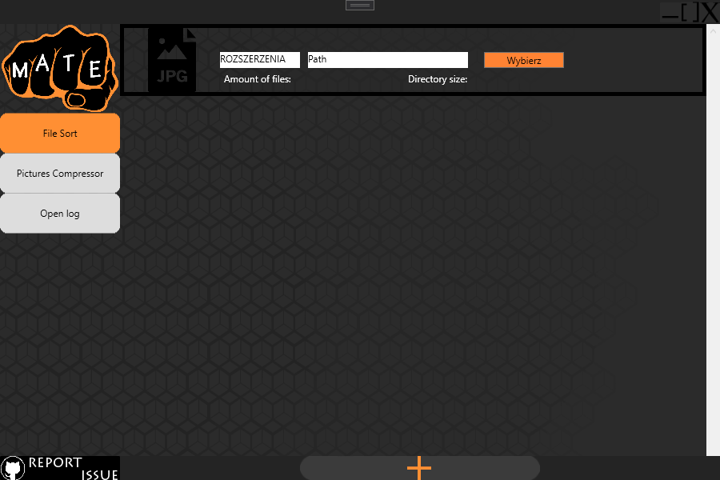
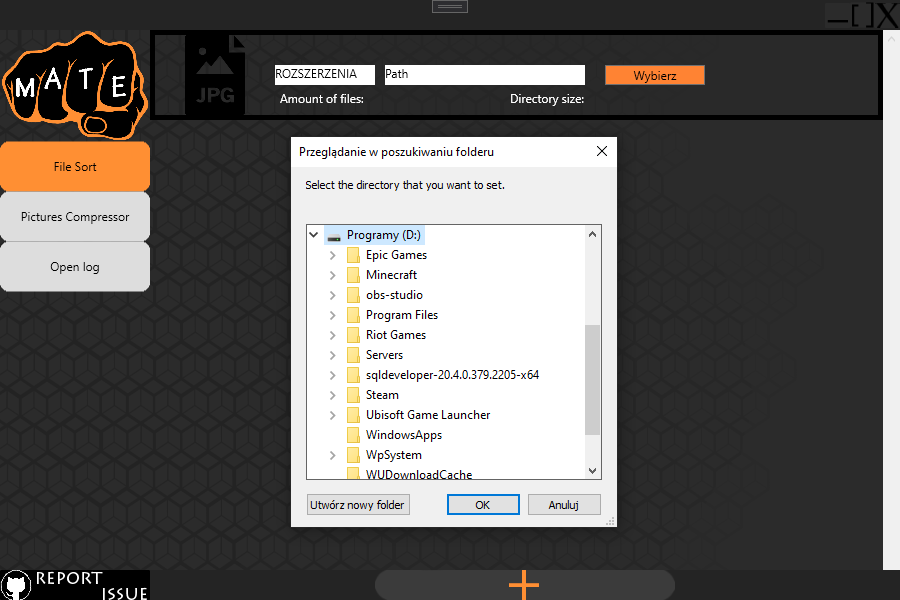
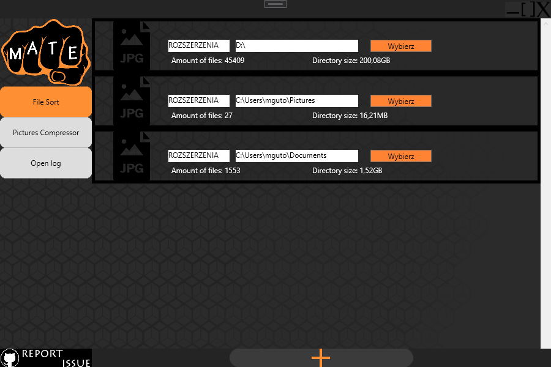

# Windows Download Manager

## Group squad:
- [Mateusz - Backend Developer](https://github.com/matelko123)
- [Piot - Frontend Developer](https://github.com/Waldees)
- [Jakub - Project Manager](https://github.com/JakubSzulc)
- [Hubert - UI Designer](https://github.com/Hubi20)

## Description
>  A Windows application for automatically organizing files downloaded by the user into the system "Downloads" directory with optional behavioral configuration depending on file extensions.

How it works?
> The program listens for changes to the \Downloads directory such as creation, renaming, and any modifications. 
For example, if a file with the extension .jpg appears, the application will automatically move the file to the previously configured path (by default \Users\..\Pictures)
For each configured path to the destination folder, the program displays brief key statistics such as the amount of files as well as the total size.

Used technology
> WPF App (.NET Framework)

## Screen Shots
StartView

SelectView

StatsView

